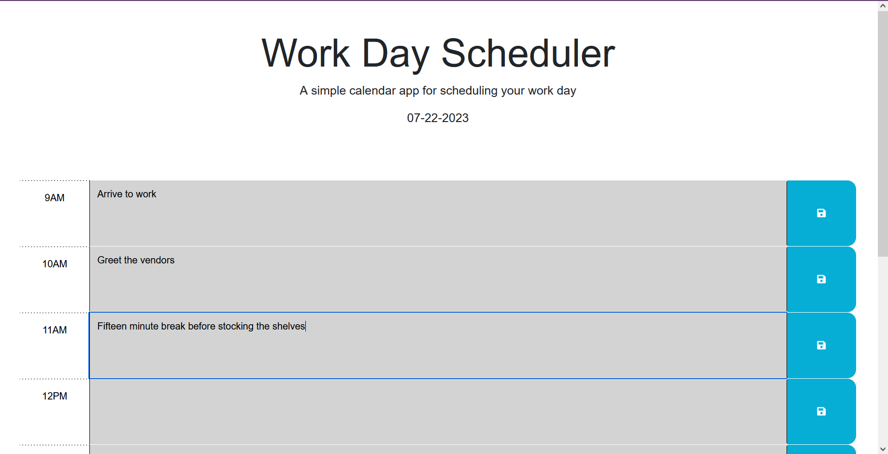

# Work Day Scheduler

## User Story
AS AN employee with a busy schedule
I WANT to add important events to a daily planner
SO THAT I can manage my time effectively

## Acceptance Criteria
GIVEN I am using a daily planner to create a schedule

WHEN I open the planner
THEN the current day is displayed at the top of the calendar

WHEN I scroll down
THEN I am presented with time blocks for standard business hours of 9am to 5pm

WHEN I view the time blocks for that day
THEN each time block is color-coded to indicate whether it is in the past, present, or future

WHEN I click into a time block
THEN I can enter an event

WHEN I click the save button for that time block
THEN the text for that event is saved in local storage

WHEN I refresh the page
THEN the saved events persist

## Description

A short and simple scheduler for a day to day 9-5 period blocked out by each hour. The user can save a schedule on a single device and the next time they open it again they will be presented with the same schedule as before. This was a great practice for jQuery and Bootstrap.

## Screenshot and Link

https://github.com/Achurale/Work-Scheduler

## Credits

Many thanks to classmate Bree for helping me with this assignment.